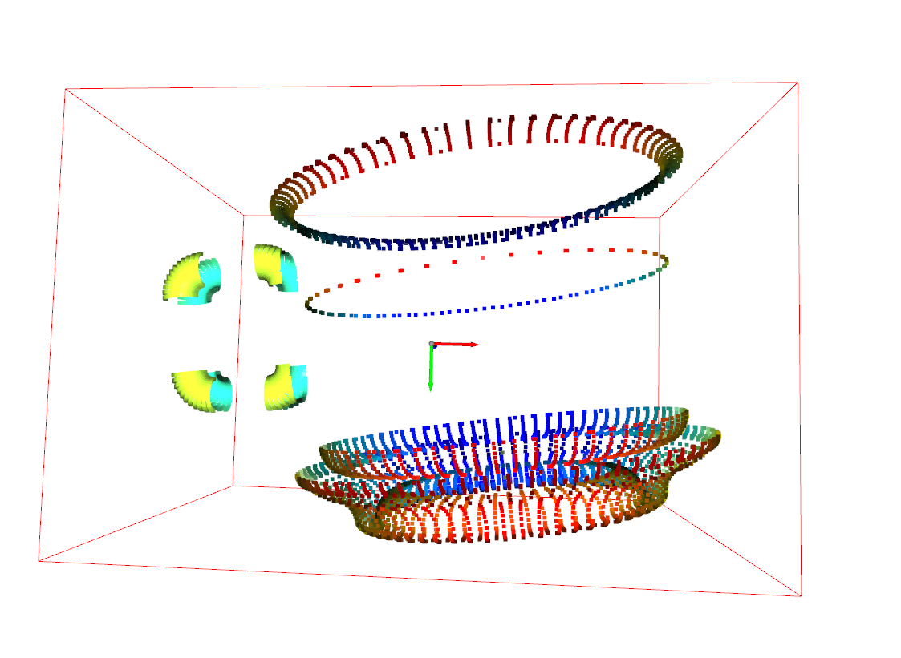

# 🏺 Cup 6D Pose Estimation with Open3D

This project estimates the **6D pose** (position + orientation) of a cup from a point cloud (`.pcd`) file using the **Oriented Bounding Box (OBB)** method from [Open3D](http://www.open3d.org/). It also visualizes the result with a coordinate frame and a red bounding box.

---



## 📦 Requirements

- Python 3.6+
- [Open3D](http://www.open3d.org/)
- SciPy
- NumPy

Install dependencies:

```bash
pip install open3d scipy numpy
```